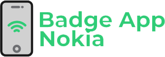
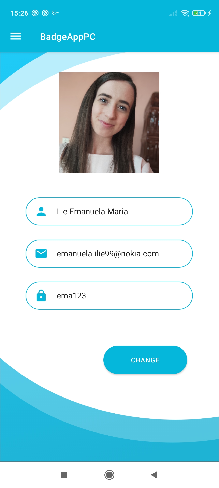

<!--
*** Thanks for checking out the Best-README-Template. If you have a suggestion
*** that would make this better, please fork the repo and create a pull request
*** or simply open an issue with the tag "enhancement".
*** Thanks again! Now go create something AMAZING! :D
-->


<!-- PROJECT SHIELDS -->
<!--
*** I'm using markdown "reference style" links for readability.
*** Reference links are enclosed in brackets [ ] instead of parentheses ( ).
*** See the bottom of this document for the declaration of the reference variables
*** for contributors-url, forks-url, etc. This is an optional, concise syntax you may use.
*** https://www.markdownguide.org/basic-syntax/#reference-style-links
-->
[![Contributors][contributors-shield]][contributors-url]
[![Forks][forks-shield]][forks-url]
[![Stargazers][stars-shield]][stars-url]
[![Issues][issues-shield]][issues-url]


<!-- PROJECT LOGO -->
<br />
<p align="center">
  <a href="https://github.com/RiceanVlad/BadgeApp">
    
  </a>

  <h3 align="center">Badge App</h3>

  <p align="center">
    Mobile App that replaces phisical cards with smartphones
    <br />
    <a href="https://github.com/RiceanVlad/BadgeApp"><strong>Explore the docs »</strong></a>
    <br />
    <br />
    ·
    <a href="https://github.com/RiceanVlad/BadgeApp/issues">Report Bug</a>
    ·
    <a href="https://github.com/RiceanVlad/BadgeApp/issues">Request Feature</a>
  </p>
</p>


<!-- TABLE OF CONTENTS -->
<details open="open">
  <summary>Table of Contents</summary>
  <ol>
    <li>
      <a href="#about-the-project">About The Project</a>
      <ul>
        <li><a href="#built-with">Built With</a></li>
      </ul>
    </li>
    <li>
      <a href="#getting-started">Getting Started</a>
      <ul>
        <li><a href="#prerequisites">Prerequisites</a></li>
        <li><a href="#installation">Installation</a></li>
      </ul>
    </li>
    <li><a href="#usage">Usage</a></li>
    <li><a href="#contributing">Contributing</a></li>
    <li><a href="#contact">Contact</a></li>
    <li><a href="#acknowledgements">Acknowledgements</a></li>
  </ol>
</details>


<!-- ABOUT THE PROJECT -->
## About The Project

I was looking for renting ski equipment mobile apps and couldn't find any so i made my own. The Ski Rental app is about renting ski equipment before you arrive at some ski resort, so they have the equipment up and ready for your arrival.

Here's why:
* You spend less time waiting at the ski resort reserving ski equipment
* It's more convenient, just pay online
* You can choose your favorite equipment
* It's coronavirus safe, less people wait in lines :smile:

### Built With

* [Android Studio](https://developer.android.com/studio)
* [Glide](https://github.com/bumptech/glide)
* [Firebase](https://firebase.google.com/)


<!-- GETTING STARTED -->
## Getting Started

To get a local copy up and running follow these simple example steps.

### Prerequisites

* Android studio
  You can download it here: https://developer.android.com/studio

### Installation

You just Clone the repo
   ```sh
   git clone (https://github.com/RiceanVlad/BadgeApp.git)
   ```

<!-- USAGE EXAMPLES -->
## Usage

Here i will post some screenshots to ilustrate how the app works.

1. Login screen


2. Easy registration


3. After login


4. This is where you scan the smartphone to gain access to building


5. Choose a department and team to join


6. Manage your profile

<a href="https://github.com/RiceanVlad/BadgeApp">
    
  </a>


<!-- CONTRIBUTING -->
## Contributing

Contributions are what make the open source community such an amazing place to be learn, inspire, and create. Any contributions you make are **greatly appreciated**.

1. Fork the Project
2. Create your Feature Branch (`git checkout -b feature/AmazingFeature`)
3. Commit your Changes (`git commit -m 'Add some AmazingFeature'`)
4. Push to the Branch (`git push origin feature/AmazingFeature`)
5. Open a Pull Request


<!-- CONTACT -->
## Contact

Ricean Ioan-Vlad - [ioan.ricean95@e-uvt.ro](ioan.ricean95@e-uvt.ro)

Project Link: [https://github.com/RiceanVlad/BadgeApp](https://github.com/RiceanVlad/BadgeApp)


<!-- ACKNOWLEDGEMENTS -->
## Acknowledgements
* [icons8](https://icons8.com/icons/set/android)
* [GitHub Pages](https://pages.github.com)


<!-- MARKDOWN LINKS & IMAGES -->
<!-- https://www.markdownguide.org/basic-syntax/#reference-style-links -->
[contributors-shield]: https://img.shields.io/github/contributors/RiceanVlad/BadgeApp.svg?style=for-the-badge
[contributors-url]: https://github.com/RiceanVlad/BadgeApp/graphs/contributors
[forks-shield]: https://img.shields.io/github/forks/RiceanVlad/BadgeApp.svg?style=for-the-badge
[forks-url]: https://github.com/RiceanVlad/BadgeApp/network/members
[stars-shield]: https://img.shields.io/github/stars/RiceanVlad/BadgeApp.svg?style=for-the-badge
[stars-url]: https://github.com/RiceanVlad/BadgeApp/stargazers
[issues-shield]: https://img.shields.io/github/issues/RiceanVlad/BadgeApp.svg?style=for-the-badge
[issues-url]: https://github.com/RiceanVlad/BadgeApp/issues
